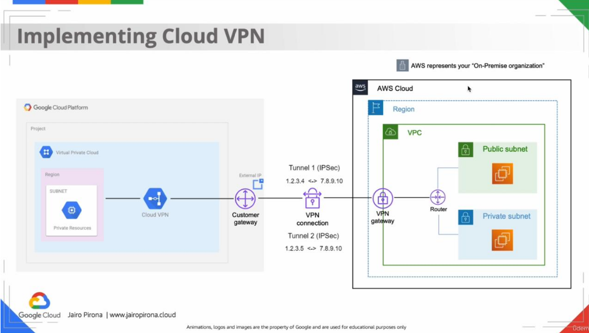

# Project 6: Site-to-Site VPN Connection Between Google Cloud Platform (GCP) and Amazon Web Services (AWS)

A comprehensive, step-by-step guide to securely interconnecting virtual private networks (**VPC**) across GCP and AWS using an IPsec encrypted tunnel with static routing (Classic VPN).

---

## 📌 Architecture & Overview

This project demonstrates a multi-cloud hybrid infrastructure pattern connecting a **Google Cloud Platform (GCP)** VPC to an **Amazon Web Services (AWS)** VPC via an **IPsec Site-to-Site VPN** tunnel.

### Network Architecture Diagram



---

## 📋 Prerequisites

* **Active GCP Account** with `Compute Admin` and `Network Admin` IAM roles.
* **Active AWS Account** with `AdministratorAccess` or equivalent permissions for VPC and EC2 management.
* Basic understanding of networking concepts (CIDR blocks, subnets, route tables, security groups, and firewall rules).

---

## 🚀 Step-by-Step Configuration Guide

### Step 1: Reserve a Static External IP Address in GCP

A static public IP address is required on the GCP side to act as the external endpoint for the VPN tunnel.

1. Navigate to **VPC Network** > **IP addresses** in the GCP Console.
2. Click **Reserve External Static IP Address**.
3. **Name:** `gcp-vpn-static-ip`.
4. **Network Service Tier:** Premium or Standard (based on your target region).
5. **Region:** Select the region matching your GCP VPC.
6. Click **Reserve** and copy the generated external IP address (e.g., `35.200.X.X`).

---

### Step 2: Configure AWS Gateways and VPN Connection

#### 2.1 Create the Customer Gateway (CGW)
The Customer Gateway represents the remote GCP VPN endpoint inside AWS.

1. Open the AWS Console and navigate to **VPC Dashboard** > **Customer Gateways**.
2. Click **Create Customer Gateway**.
3. **Name tag:** `cgw-gcp-endpoint`.
4. **Routing:** Select `Static`.
5. **IP Address:** Enter the static external IP reserved in GCP (`35.200.X.X`).
6. Click **Create Customer Gateway**.

#### 2.2 Create and Attach the Virtual Private Gateway (VGW)
The VGW serves as the VPN concentrator on the AWS side.

1. Go to **Virtual Private Gateways** > **Create Virtual Private Gateway**.
2. **Name tag:** `vgw-aws-vpn`.
3. Click **Create Virtual Private Gateway**.
4. Select the created VGW, click **Actions** > **Attach to VPC**, and choose your target AWS VPC.

#### 2.3 Create the Site-to-Site VPN Connection
1. Go to **Site-to-Site VPN Connections** > **Create VPN Connection**.
2. **Name tag:** `vpn-aws-to-gcp`.
3. **Target Gateway Type:** Select `Virtual Private Gateway` (`vgw-aws-vpn`).
4. **Customer Gateway:** Select `Existing` (`cgw-gcp-endpoint`).
5. **Routing Options:** Select `Static`.
6. **Static IP Prefixes:** Enter the GCP VPC/subnet CIDR block (e.g., `10.128.0.0/20`).
7. Click **Create VPN Connection**.

---

### Step 3: Download AWS VPN Configuration Metadata

1. Select the newly created VPN connection (`vpn-aws-to-gcp`).
2. Click **Download Configuration**.
3. Select parameters:
   * **Vendor:** `Generic`
   * **Platform:** `Generic`
   * **Software:** `Vendor Agnostic`
4. Open the downloaded text file and retrieve the following parameter values (Tunnel 1):
   * **Virtual Private Gateway External IP (AWS Endpoint):** `54.X.X.X`
   * **Pre-Shared Key (PSK):** `generated_secret_string`
   * **IKE Version:** IKEv2 (or IKEv1)

---

### Step 4: Configure GCP Classic VPN and Static Routes

1. In GCP, go to **Hybrid Connectivity** > **VPN**.
2. Click **Create VPN Connection** and select **Classic VPN**.
3. **VPN Gateway:**
   * **Name:** `gcp-classic-vpn`
   * **Network:** Select your target GCP VPC.
   * **IP Address:** Select the static IP reserved in Step 1.
4. **Tunnels Section:**
   * **Name:** `tunnel-to-aws`
   * **Remote Peer IP Address:** Enter the AWS VGW External IP (`54.X.X.X` from Step 3).
   * **IKE Version:** `IKEv2` (matching AWS configuration).
   * **IKE Pre-shared Key:** Paste the PSK obtained from AWS.
   * **Routing Options:** Select `Static`.
   * **Remote Network IP Ranges:** Enter the AWS VPC CIDR block (e.g., `172.31.0.0/16`).
5. Click **Create**.

---

### Step 5: Configure Route Tables and Firewall Rules

#### 5.1 GCP Firewall Rules
1. Go to **VPC Network** > **Firewall**.
2. Create rule `allow-aws-icmp-internal`:
   * **Direction:** Ingress
   * **Source Filter:** IP Ranges (`172.31.0.0/16` — AWS CIDR)
   * **Protocols/Ports:** Specified protocols > `icmp`, `tcp:22`

#### 5.2 AWS Route Tables & Security Groups
1. Go to **VPC** > **Route Tables** and select the route table associated with your AWS subnet.
2. Under the **Routes** tab, add:
   * **Destination:** `10.128.0.0/20` (GCP CIDR)
   * **Target:** `Virtual Private Gateway` (`vgw-aws-vpn`)
3. Update the **Security Group** assigned to your AWS EC2 instance to allow inbound traffic:
   * **Type:** All ICMP / SSH
   * **Source:** `10.128.0.0/20` (GCP CIDR)

---

### Step 6: Deploy Test Instances and Verify Connectivity

1. **Deploy GCP Instance (Compute Engine):**
   * Name: `gcp-vm-test`
   * VPC/Subnet: Attached to the VPN-enabled VPC
   * Private IP: `10.128.0.2` (example)
2. **Deploy AWS Instance (EC2):**
   * Name: `aws-ec2-test`
   * VPC/Subnet: Attached to the VPN-enabled VPC
   * Private IP: `172.31.16.2` (example)
3. **Execute Connectivity Test:**
   * SSH into the GCP virtual machine (`gcp-vm-test`).
   * Ping the private IP of the AWS EC2 instance:
     ```bash
     ping -c 4 172.31.16.2
     ```
   * Repeat the verification step in reverse (SSH into EC2 and ping `10.128.0.2`).

---

## 🔒 Security Best Practices

* **Secret Management:** Never commit Pre-Shared Keys (PSKs) or raw configuration files to public repositories. Use environment variables or secret vaults.
* **Principle of Least Privilege:** Restrict Security Groups and GCP Firewall Rules strictly to necessary CIDR ranges and required ports instead of exposing `0.0.0.0/0`.
